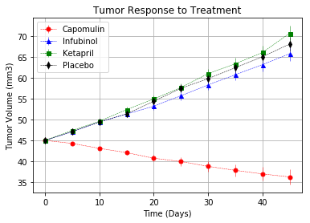

```python
# Dependencies and Setup
%matplotlib inline
import matplotlib.pyplot as plt
import pandas as pd
import numpy as np

# Hide warning messages in notebook
import warnings
warnings.filterwarnings('ignore')

# File to Load (Remember to Change These)
mouse_drug_data_to_load = "./data/mouse_drug_data.csv"
clinical_trial_data_to_load = "./data/clinicaltrial_data.csv"

# Read the Mouse and Drug Data and the Clinical Trial Data
mouse_data = pd.read_csv(mouse_drug_data_to_load)
clinical_data = pd.read_csv(clinical_trial_data_to_load)

# Combine the data into a single dataset
merged_data = pd.merge(clinical_data, mouse_data).sort_values(by="Timepoint")

# Display the data table for preview
merged_data.head()

```


<div>
<style scoped>
    .dataframe tbody tr th:only-of-type {
        vertical-align: middle;
    }

    .dataframe tbody tr th {
        vertical-align: top;
    }

    .dataframe thead th {
        text-align: right;
    }
</style>
<table border="1" class="dataframe">
  <thead>
    <tr style="text-align: right;">
      <th></th>
      <th>Mouse ID</th>
      <th>Timepoint</th>
      <th>Tumor Volume (mm3)</th>
      <th>Metastatic Sites</th>
      <th>Drug</th>
    </tr>
  </thead>
  <tbody>
    <tr>
      <th>0</th>
      <td>b128</td>
      <td>0</td>
      <td>45.0</td>
      <td>0</td>
      <td>Capomulin</td>
    </tr>
    <tr>
      <th>1535</th>
      <td>i635</td>
      <td>0</td>
      <td>45.0</td>
      <td>0</td>
      <td>Propriva</td>
    </tr>
    <tr>
      <th>565</th>
      <td>g791</td>
      <td>0</td>
      <td>45.0</td>
      <td>0</td>
      <td>Ramicane</td>
    </tr>
    <tr>
      <th>1545</th>
      <td>w746</td>
      <td>0</td>
      <td>45.0</td>
      <td>0</td>
      <td>Propriva</td>
    </tr>
    <tr>
      <th>1547</th>
      <td>r107</td>
      <td>0</td>
      <td>45.0</td>
      <td>0</td>
      <td>Propriva</td>
    </tr>
  </tbody>
</table>
</div>


## Tumor Response to Treatment


```python
# Store the Mean Tumor Volume Data Grouped by Drug and Timepoint 
drug_time_data = merged_data.groupby(by=["Drug", "Timepoint"])["Tumor Volume (mm3)"]

# Convert to DataFrame
data_mean = pd.DataFrame(drug_time_data.mean().reset_index())

# Preview DataFrame
data_mean.head()
```


<div>
<style scoped>
    .dataframe tbody tr th:only-of-type {
        vertical-align: middle;
    }

    .dataframe tbody tr th {
        vertical-align: top;
    }

    .dataframe thead th {
        text-align: right;
    }
</style>
<table border="1" class="dataframe">
  <thead>
    <tr style="text-align: right;">
      <th></th>
      <th>Drug</th>
      <th>Timepoint</th>
      <th>Tumor Volume (mm3)</th>
    </tr>
  </thead>
  <tbody>
    <tr>
      <th>0</th>
      <td>Capomulin</td>
      <td>0</td>
      <td>45.000000</td>
    </tr>
    <tr>
      <th>1</th>
      <td>Capomulin</td>
      <td>5</td>
      <td>44.266086</td>
    </tr>
    <tr>
      <th>2</th>
      <td>Capomulin</td>
      <td>10</td>
      <td>43.084291</td>
    </tr>
    <tr>
      <th>3</th>
      <td>Capomulin</td>
      <td>15</td>
      <td>42.064317</td>
    </tr>
    <tr>
      <th>4</th>
      <td>Capomulin</td>
      <td>20</td>
      <td>40.716325</td>
    </tr>
  </tbody>
</table>
</div>


```python
# Store the Standard Error of Tumor Volumes Grouped by Drug and Timepoint
data_series = pd.DataFrame(drug_time_data.sem())

# Convert to DataFrame
data_series.reset_index(inplace=True)

# Preview DataFrame
data_series.head()
```


<div>
<style scoped>
    .dataframe tbody tr th:only-of-type {
        vertical-align: middle;
    }

    .dataframe tbody tr th {
        vertical-align: top;
    }

    .dataframe thead th {
        text-align: right;
    }
</style>
<table border="1" class="dataframe">
  <thead>
    <tr style="text-align: right;">
      <th></th>
      <th>Drug</th>
      <th>Timepoint</th>
      <th>Tumor Volume (mm3)</th>
    </tr>
  </thead>
  <tbody>
    <tr>
      <th>0</th>
      <td>Capomulin</td>
      <td>0</td>
      <td>0.000000</td>
    </tr>
    <tr>
      <th>1</th>
      <td>Capomulin</td>
      <td>5</td>
      <td>0.448593</td>
    </tr>
    <tr>
      <th>2</th>
      <td>Capomulin</td>
      <td>10</td>
      <td>0.702684</td>
    </tr>
    <tr>
      <th>3</th>
      <td>Capomulin</td>
      <td>15</td>
      <td>0.838617</td>
    </tr>
    <tr>
      <th>4</th>
      <td>Capomulin</td>
      <td>20</td>
      <td>0.909731</td>
    </tr>
  </tbody>
</table>
</div>


```python
# Minor Data Munging to Re-Format the Data Frames
Reformatting = data_mean.pivot(index="Timepoint", columns="Drug", values="Tumor Volume (mm3)")

# Preview that Reformatting.head()
Reformatting.head()
```


<div>
<style scoped>
    .dataframe tbody tr th:only-of-type {
        vertical-align: middle;
    }

    .dataframe tbody tr th {
        vertical-align: top;
    }

    .dataframe thead th {
        text-align: right;
    }
</style>
<table border="1" class="dataframe">
  <thead>
    <tr style="text-align: right;">
      <th>Drug</th>
      <th>Capomulin</th>
      <th>Ceftamin</th>
      <th>Infubinol</th>
      <th>Ketapril</th>
      <th>Naftisol</th>
      <th>Placebo</th>
      <th>Propriva</th>
      <th>Ramicane</th>
      <th>Stelasyn</th>
      <th>Zoniferol</th>
    </tr>
    <tr>
      <th>Timepoint</th>
      <th></th>
      <th></th>
      <th></th>
      <th></th>
      <th></th>
      <th></th>
      <th></th>
      <th></th>
      <th></th>
      <th></th>
    </tr>
  </thead>
  <tbody>
    <tr>
      <th>0</th>
      <td>45.000000</td>
      <td>45.000000</td>
      <td>45.000000</td>
      <td>45.000000</td>
      <td>45.000000</td>
      <td>45.000000</td>
      <td>45.000000</td>
      <td>45.000000</td>
      <td>45.000000</td>
      <td>45.000000</td>
    </tr>
    <tr>
      <th>5</th>
      <td>44.266086</td>
      <td>46.503051</td>
      <td>47.062001</td>
      <td>47.389175</td>
      <td>46.796098</td>
      <td>47.125589</td>
      <td>47.248967</td>
      <td>43.944859</td>
      <td>47.527452</td>
      <td>46.851818</td>
    </tr>
    <tr>
      <th>10</th>
      <td>43.084291</td>
      <td>48.285125</td>
      <td>49.403909</td>
      <td>49.582269</td>
      <td>48.694210</td>
      <td>49.423329</td>
      <td>49.101541</td>
      <td>42.531957</td>
      <td>49.463844</td>
      <td>48.689881</td>
    </tr>
    <tr>
      <th>15</th>
      <td>42.064317</td>
      <td>50.094055</td>
      <td>51.296397</td>
      <td>52.399974</td>
      <td>50.933018</td>
      <td>51.359742</td>
      <td>51.067318</td>
      <td>41.495061</td>
      <td>51.529409</td>
      <td>50.779059</td>
    </tr>
    <tr>
      <th>20</th>
      <td>40.716325</td>
      <td>52.157049</td>
      <td>53.197691</td>
      <td>54.920935</td>
      <td>53.644087</td>
      <td>54.364417</td>
      <td>53.346737</td>
      <td>40.238325</td>
      <td>54.067395</td>
      <td>53.170334</td>
    </tr>
  </tbody>
</table>
</div>


```python
# Generate the Plot (with Error Bars)
x = Reformatting.index.values
yerr_ = np.arange(0, 2, 0.2)
xerr_ = 0

plt.ioff()

fig = plt.figure()

plt.errorbar(x, Reformatting['Capomulin'],xerr=xerr_, yerr=yerr_, fmt='ro--', ecolor='red', linewidth=0.5, markersize=5)
plt.errorbar(x, Reformatting['Infubinol'],xerr=xerr_, yerr=yerr_, fmt='b^--', ecolor='blue', linewidth=0.5, markersize=5)
plt.errorbar(x, Reformatting['Ketapril'],xerr=xerr_, yerr=yerr_, fmt='gs--', ecolor='green', linewidth=0.5, markersize=5)
plt.errorbar(x, Reformatting['Placebo'],xerr=xerr_, yerr=yerr_, fmt='kd--', ecolor='black', linewidth=0.5, markersize=5)

plt.title('Tumor Response to Treatment')
plt.ylabel('Tumor Volume (mm3)')
plt.xlabel('Time (Days)')

plt.legend()
plt.grid()

# Save the Figure
fig.savefig('./images/Reformatting.png')
```





```python
# Show the Figure
plt.show()
```

## Metastatic Response to Treatment


```python
# Store the Mean Met. Site Data Grouped by Drug and Timepoint 
drug_time_met_site = merged_data.groupby(by=["Drug", "Timepoint"])["Metastatic Sites"]

# Convert to DataFrame
drug_time_met_site = pd.DataFrame(drug_time_met_site.mean())

# Preview DataFrame
drug_time_met_site.head()
```


<div>
<style scoped>
    .dataframe tbody tr th:only-of-type {
        vertical-align: middle;
    }

    .dataframe tbody tr th {
        vertical-align: top;
    }

    .dataframe thead th {
        text-align: right;
    }
</style>
<table border="1" class="dataframe">
  <thead>
    <tr style="text-align: right;">
      <th></th>
      <th></th>
      <th>Metastatic Sites</th>
    </tr>
    <tr>
      <th>Drug</th>
      <th>Timepoint</th>
      <th></th>
    </tr>
  </thead>
  <tbody>
    <tr>
      <th rowspan="5" valign="top">Capomulin</th>
      <th>0</th>
      <td>0.000000</td>
    </tr>
    <tr>
      <th>5</th>
      <td>0.160000</td>
    </tr>
    <tr>
      <th>10</th>
      <td>0.320000</td>
    </tr>
    <tr>
      <th>15</th>
      <td>0.375000</td>
    </tr>
    <tr>
      <th>20</th>
      <td>0.652174</td>
    </tr>
  </tbody>
</table>
</div>


```python
# Store the Standard Error associated with Met. Sites Grouped by Drug and Timepoint 
drug_time_met_site_sem = merged_data.groupby(by=["Drug", "Timepoint"])["Metastatic Sites"]

# Convert to DataFrame
drug_time_met_site_sem = pd.DataFrame(drug_time_met_site_sem.sem())

# Preview DataFrame
drug_time_met_site_sem.head()
```


<div>
<style scoped>
    .dataframe tbody tr th:only-of-type {
        vertical-align: middle;
    }

    .dataframe tbody tr th {
        vertical-align: top;
    }

    .dataframe thead th {
        text-align: right;
    }
</style>
<table border="1" class="dataframe">
  <thead>
    <tr style="text-align: right;">
      <th></th>
      <th></th>
      <th>Metastatic Sites</th>
    </tr>
    <tr>
      <th>Drug</th>
      <th>Timepoint</th>
      <th></th>
    </tr>
  </thead>
  <tbody>
    <tr>
      <th rowspan="5" valign="top">Capomulin</th>
      <th>0</th>
      <td>0.000000</td>
    </tr>
    <tr>
      <th>5</th>
      <td>0.074833</td>
    </tr>
    <tr>
      <th>10</th>
      <td>0.125433</td>
    </tr>
    <tr>
      <th>15</th>
      <td>0.132048</td>
    </tr>
    <tr>
      <th>20</th>
      <td>0.161621</td>
    </tr>
  </tbody>
</table>
</div>


```python
# Minor Data Munging to Re-Format the Data Frames
drug_time_met_site.reset_index(inplace=True)
drug_time_met_site = drug_time_met_site.pivot(index="Timepoint", columns="Drug", values="Metastatic Sites")

# Preview that Reformatting worked

drug_time_met_site.head()
```


<div>
<style scoped>
    .dataframe tbody tr th:only-of-type {
        vertical-align: middle;
    }

    .dataframe tbody tr th {
        vertical-align: top;
    }

    .dataframe thead th {
        text-align: right;
    }
</style>
<table border="1" class="dataframe">
  <thead>
    <tr style="text-align: right;">
      <th>Drug</th>
      <th>Capomulin</th>
      <th>Ceftamin</th>
      <th>Infubinol</th>
      <th>Ketapril</th>
      <th>Naftisol</th>
      <th>Placebo</th>
      <th>Propriva</th>
      <th>Ramicane</th>
      <th>Stelasyn</th>
      <th>Zoniferol</th>
    </tr>
    <tr>
      <th>Timepoint</th>
      <th></th>
      <th></th>
      <th></th>
      <th></th>
      <th></th>
      <th></th>
      <th></th>
      <th></th>
      <th></th>
      <th></th>
    </tr>
  </thead>
  <tbody>
    <tr>
      <th>0</th>
      <td>0.000000</td>
      <td>0.000000</td>
      <td>0.000000</td>
      <td>0.000000</td>
      <td>0.000000</td>
      <td>0.000000</td>
      <td>0.000000</td>
      <td>0.000000</td>
      <td>0.000000</td>
      <td>0.000000</td>
    </tr>
    <tr>
      <th>5</th>
      <td>0.160000</td>
      <td>0.380952</td>
      <td>0.280000</td>
      <td>0.304348</td>
      <td>0.260870</td>
      <td>0.375000</td>
      <td>0.320000</td>
      <td>0.120000</td>
      <td>0.240000</td>
      <td>0.166667</td>
    </tr>
    <tr>
      <th>10</th>
      <td>0.320000</td>
      <td>0.600000</td>
      <td>0.666667</td>
      <td>0.590909</td>
      <td>0.523810</td>
      <td>0.833333</td>
      <td>0.565217</td>
      <td>0.250000</td>
      <td>0.478261</td>
      <td>0.500000</td>
    </tr>
    <tr>
      <th>15</th>
      <td>0.375000</td>
      <td>0.789474</td>
      <td>0.904762</td>
      <td>0.842105</td>
      <td>0.857143</td>
      <td>1.250000</td>
      <td>0.764706</td>
      <td>0.333333</td>
      <td>0.782609</td>
      <td>0.809524</td>
    </tr>
    <tr>
      <th>20</th>
      <td>0.652174</td>
      <td>1.111111</td>
      <td>1.050000</td>
      <td>1.210526</td>
      <td>1.150000</td>
      <td>1.526316</td>
      <td>1.000000</td>
      <td>0.347826</td>
      <td>0.952381</td>
      <td>1.294118</td>
    </tr>
  </tbody>
</table>
</div>


```python
# Generate the Plot (with Error Bars)
x = drug_time_met_site.index.values
yerr_ = np.arange(0, 0.3, 0.03)
xerr_ = 0

plt.ioff()

fig = plt.figure()
plt.errorbar(x, drug_time_met_site['Capomulin'],xerr=xerr_, yerr=yerr_, fmt='ro--', ecolor='red', linewidth=0.5, markersize=5)
plt.errorbar(x, drug_time_met_site['Infubinol'],xerr=xerr_, yerr=yerr_, fmt='b^--', ecolor='blue', linewidth=0.5, markersize=5)
plt.errorbar(x, drug_time_met_site['Ketapril'],xerr=xerr_, yerr=yerr_, fmt='gs--', ecolor='green', linewidth=0.5, markersize=5)
plt.errorbar(x, drug_time_met_site['Placebo'],xerr=xerr_, yerr=yerr_, fmt='kd--', ecolor='black', linewidth=0.5, markersize=5)

plt.title('Metastatic Spread During Treatment')
plt.ylabel('Met. Sites')
plt.xlabel('Treatment Duration (Days)')

plt.legend()
plt.grid()

# Save the Figure
plt.savefig('./images/metSite.png')
# Show the Figure
plt.show()
```


## Survival Rates


```python
merged_data.head()
```


<div>
<style scoped>
    .dataframe tbody tr th:only-of-type {
        vertical-align: middle;
    }

    .dataframe tbody tr th {
        vertical-align: top;
    }

    .dataframe thead th {
        text-align: right;
    }
</style>
<table border="1" class="dataframe">
  <thead>
    <tr style="text-align: right;">
      <th></th>
      <th>Mouse ID</th>
      <th>Timepoint</th>
      <th>Tumor Volume (mm3)</th>
      <th>Metastatic Sites</th>
      <th>Drug</th>
    </tr>
  </thead>
  <tbody>
    <tr>
      <th>0</th>
      <td>b128</td>
      <td>0</td>
      <td>45.0</td>
      <td>0</td>
      <td>Capomulin</td>
    </tr>
    <tr>
      <th>1535</th>
      <td>i635</td>
      <td>0</td>
      <td>45.0</td>
      <td>0</td>
      <td>Propriva</td>
    </tr>
    <tr>
      <th>565</th>
      <td>g791</td>
      <td>0</td>
      <td>45.0</td>
      <td>0</td>
      <td>Ramicane</td>
    </tr>
    <tr>
      <th>1545</th>
      <td>w746</td>
      <td>0</td>
      <td>45.0</td>
      <td>0</td>
      <td>Propriva</td>
    </tr>
    <tr>
      <th>1547</th>
      <td>r107</td>
      <td>0</td>
      <td>45.0</td>
      <td>0</td>
      <td>Propriva</td>
    </tr>
  </tbody>
</table>
</div>


```python
# Store the Count of Mice Grouped by Drug and Timepoint (W can pass any metric)
drug_time_mice = merged_data.groupby(by=["Drug", "Timepoint"])["Mouse ID"]

# Convert to DataFrame
drug_time_mice = pd.DataFrame(drug_time_mice.count()).reset_index()

# Preview DataFrame
drug_time_mice.head()
```


<div>
<style scoped>
    .dataframe tbody tr th:only-of-type {
        vertical-align: middle;
    }

    .dataframe tbody tr th {
        vertical-align: top;
    }

    .dataframe thead th {
        text-align: right;
    }
</style>
<table border="1" class="dataframe">
  <thead>
    <tr style="text-align: right;">
      <th></th>
      <th>Drug</th>
      <th>Timepoint</th>
      <th>Mouse ID</th>
    </tr>
  </thead>
  <tbody>
    <tr>
      <th>0</th>
      <td>Capomulin</td>
      <td>0</td>
      <td>25</td>
    </tr>
    <tr>
      <th>1</th>
      <td>Capomulin</td>
      <td>5</td>
      <td>25</td>
    </tr>
    <tr>
      <th>2</th>
      <td>Capomulin</td>
      <td>10</td>
      <td>25</td>
    </tr>
    <tr>
      <th>3</th>
      <td>Capomulin</td>
      <td>15</td>
      <td>24</td>
    </tr>
    <tr>
      <th>4</th>
      <td>Capomulin</td>
      <td>20</td>
      <td>23</td>
    </tr>
  </tbody>
</table>
</div>


```python
# Minor Data Munging to Re-Format the Data Frames
drug_time_mice = drug_time_mice.pivot(index="Timepoint", columns="Drug", values="Mouse ID")

# Preview the Data Frame
drug_time_mice.head()
```


<div>
<style scoped>
    .dataframe tbody tr th:only-of-type {
        vertical-align: middle;
    }

    .dataframe tbody tr th {
        vertical-align: top;
    }

    .dataframe thead th {
        text-align: right;
    }
</style>
<table border="1" class="dataframe">
  <thead>
    <tr style="text-align: right;">
      <th>Drug</th>
      <th>Capomulin</th>
      <th>Ceftamin</th>
      <th>Infubinol</th>
      <th>Ketapril</th>
      <th>Naftisol</th>
      <th>Placebo</th>
      <th>Propriva</th>
      <th>Ramicane</th>
      <th>Stelasyn</th>
      <th>Zoniferol</th>
    </tr>
    <tr>
      <th>Timepoint</th>
      <th></th>
      <th></th>
      <th></th>
      <th></th>
      <th></th>
      <th></th>
      <th></th>
      <th></th>
      <th></th>
      <th></th>
    </tr>
  </thead>
  <tbody>
    <tr>
      <th>0</th>
      <td>25</td>
      <td>25</td>
      <td>25</td>
      <td>25</td>
      <td>25</td>
      <td>25</td>
      <td>26</td>
      <td>25</td>
      <td>26</td>
      <td>25</td>
    </tr>
    <tr>
      <th>5</th>
      <td>25</td>
      <td>21</td>
      <td>25</td>
      <td>23</td>
      <td>23</td>
      <td>24</td>
      <td>25</td>
      <td>25</td>
      <td>25</td>
      <td>24</td>
    </tr>
    <tr>
      <th>10</th>
      <td>25</td>
      <td>20</td>
      <td>21</td>
      <td>22</td>
      <td>21</td>
      <td>24</td>
      <td>23</td>
      <td>24</td>
      <td>23</td>
      <td>22</td>
    </tr>
    <tr>
      <th>15</th>
      <td>24</td>
      <td>19</td>
      <td>21</td>
      <td>19</td>
      <td>21</td>
      <td>20</td>
      <td>17</td>
      <td>24</td>
      <td>23</td>
      <td>21</td>
    </tr>
    <tr>
      <th>20</th>
      <td>23</td>
      <td>18</td>
      <td>20</td>
      <td>19</td>
      <td>20</td>
      <td>19</td>
      <td>17</td>
      <td>23</td>
      <td>21</td>
      <td>17</td>
    </tr>
  </tbody>
</table>
</div>


```python
def calculate_percentage(value, total):
    return (value / total) * 100
```


```python
# Generate the Plot (Accounting for percentages)

x = drug_time_mice.index.values
yerr_ = 0
xerr_ = 0

plt.ioff()

fig = plt.figure()
plt.errorbar(x, drug_time_mice['Capomulin'].apply(lambda x: calculate_percentage(x, 25)),xerr=xerr_, yerr=yerr_, fmt='ro--', ecolor='red', linewidth=0.5, markersize=5)
plt.errorbar(x, drug_time_mice['Infubinol'].apply(lambda x: calculate_percentage(x, 25)),xerr=xerr_, yerr=yerr_, fmt='b^--', ecolor='blue', linewidth=0.5, markersize=5)
plt.errorbar(x, drug_time_mice['Ketapril'].apply(lambda x: calculate_percentage(x, 25)),xerr=xerr_, yerr=yerr_, fmt='gs--', ecolor='green', linewidth=0.5, markersize=5)
plt.errorbar(x, drug_time_mice['Placebo'].apply(lambda x: calculate_percentage(x, 25)),xerr=xerr_, yerr=yerr_, fmt='kd--', ecolor='black', linewidth=0.5, markersize=5)

plt.title('Survival During Treatment')
plt.ylabel('Survival Rate (%)')
plt.xlabel('Time (Days)')
plt.legend()
plt.grid()

# Save the Figure
plt.savefig('./images/mice.png')

# Show the Figure
plt.show()
```


## Summary Bar Graph


```python
merged_data.head()
```


<div>
<style scoped>
    .dataframe tbody tr th:only-of-type {
        vertical-align: middle;
    }

    .dataframe tbody tr th {
        vertical-align: top;
    }

    .dataframe thead th {
        text-align: right;
    }
</style>
<table border="1" class="dataframe">
  <thead>
    <tr style="text-align: right;">
      <th></th>
      <th>Mouse ID</th>
      <th>Timepoint</th>
      <th>Tumor Volume (mm3)</th>
      <th>Metastatic Sites</th>
      <th>Drug</th>
    </tr>
  </thead>
  <tbody>
    <tr>
      <th>0</th>
      <td>b128</td>
      <td>0</td>
      <td>45.0</td>
      <td>0</td>
      <td>Capomulin</td>
    </tr>
    <tr>
      <th>1535</th>
      <td>i635</td>
      <td>0</td>
      <td>45.0</td>
      <td>0</td>
      <td>Propriva</td>
    </tr>
    <tr>
      <th>565</th>
      <td>g791</td>
      <td>0</td>
      <td>45.0</td>
      <td>0</td>
      <td>Ramicane</td>
    </tr>
    <tr>
      <th>1545</th>
      <td>w746</td>
      <td>0</td>
      <td>45.0</td>
      <td>0</td>
      <td>Propriva</td>
    </tr>
    <tr>
      <th>1547</th>
      <td>r107</td>
      <td>0</td>
      <td>45.0</td>
      <td>0</td>
      <td>Propriva</td>
    </tr>
  </tbody>
</table>
</div>


```python
# Calculate the percent changes for each drug
# First I get the mean on Tumor Volume (mm3), grouping by Drug and TimePoint, in order to have a distribution per drug.
ds = merged_data \
        .groupby(by=["Drug", "Timepoint"])["Tumor Volume (mm3)"] \
        .mean() \
        .reset_index()

# Then I try to pivot the data frame in order to set columns of values per drug.
ds = ds.pivot(index="Timepoint", columns="Drug", values="Tumor Volume (mm3)") \
        .reset_index() \
        .drop(columns="Timepoint")

# Apply the Percent Change function from pandas! NOTE: I am taking 9 as the periods because is the number of observations.
ds = ds.pct_change(periods=9) * 100

ds = ds.tail(1).squeeze()

# Display the data to confirm
ds
```


    Drug
    Capomulin   -19.475303
    Ceftamin     42.516492
    Infubinol    46.123472
    Ketapril     57.028795
    Naftisol     53.923347
    Placebo      51.297960
    Propriva     47.241175
    Ramicane    -22.320900
    Stelasyn     52.085134
    Zoniferol    46.579751
    Name: 9, dtype: float64


```python
fig = plt.figure()

# Store all Relevant Percent Changes into a Tuple
ds = ds[["Capomulin", "Infubinol", "Ketapril", "Placebo"]]

# Splice the data between passing and failing drugs
fig, ax = plt.subplots()

index = np.arange(len(ds))
y_value = np.asarray(ds)

mask1 = y_value < 0
mask2 = y_value >= 0

chart1 = ax.bar(index[mask1], y_value[mask1], 1, color='g')
chart2 = ax.bar(index[mask2], y_value[mask2], 1, color='r')

# Orient widths. Add labels, tick marks, etc. 
ax.set_title('Tumor Change Over 45 day Treatment')
ax.set_ylabel('% Tumor Volume Change')

ax.set_ylim(bottom=-30, top= 70)

ax.set_xticks(index + 0.5)
ax.set_xticklabels(ds.index)

ax.grid()

# Use functions to label the percentages of changes
def printLabel(bars):
    
    for bar in bars:
        height = int(bar.get_height())
        
        xloc = bar.get_x() + bar.get_width()/2.0
        
        if height < 0:
            yloc = -10
        else:
            yloc = 2

            
        ax.text(xloc, yloc, '{}%'.format(height), horizontalalignment="center",
                         verticalalignment='bottom', color="w")

# Call functions to implement the function calls
printLabel(chart1)
printLabel(chart2)

# Save the Figure
fig.savefig('./images/45Treatment.png')

# Show the Figure
fig.show()
```


    <Figure size 432x288 with 0 Axes>


